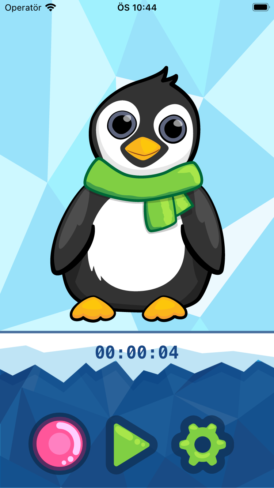
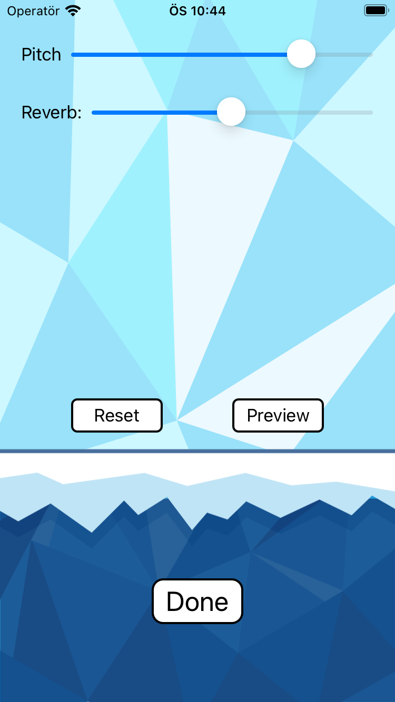

  

Penguin pet is a simple voice changing app. 
You record your voice then change the pitch and reverb properties and play it back.

## Features

- [x] Voice record and playback.
- [x] Change the Pitch and reverb properties of the recorded voice.

## Technology and API

- SwiftUI
- UIKit
- AVFoundation

## Requirements

- Xcode > 13.0
- Swift > 5.0

## How to run
1. Clone the repo
2. Open PenguinPet.xcodeproj
3. Select a simualtor and click on run (CMD+R)

## Contact

iOS Developer - Can Dayan – hcdayan@hotmail.com – [@Linkedin](https://www.linkedin.com/in/can-d/) – [@Medium](https://activesludge.medium.com/) - [@Stackoverflow](https://stackoverflow.com/users/12594970/active-sludge)
____

 

##### Disclaimer:  The original idea and images does not belong to me. This project is done just for practice and learning purposes by following a tutorial provided by raywanderlich.com.